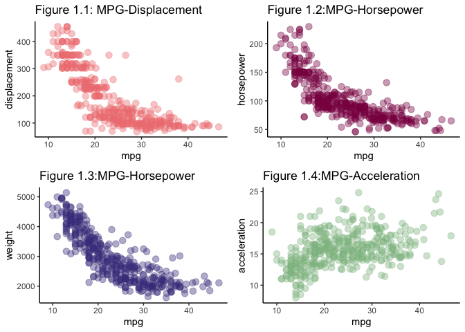
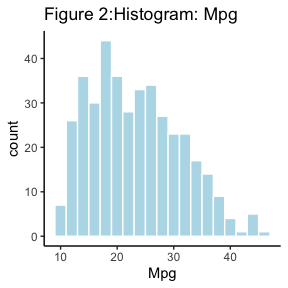
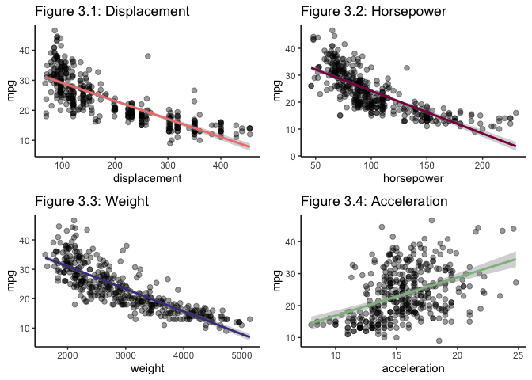
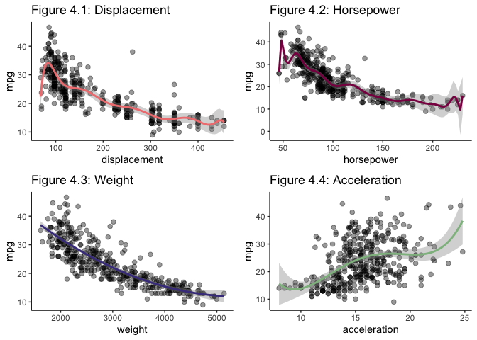
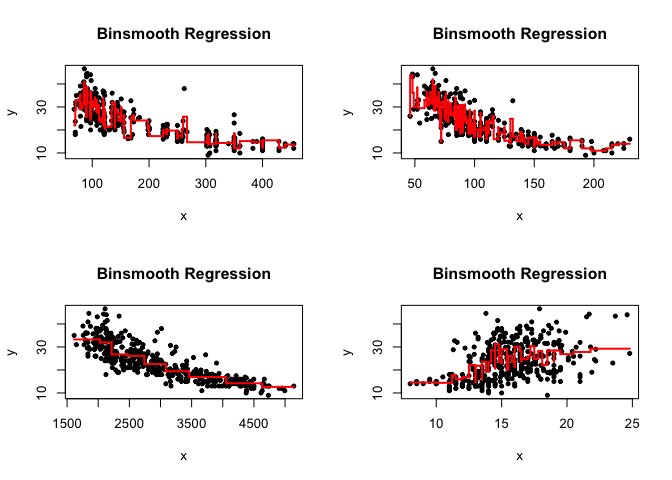
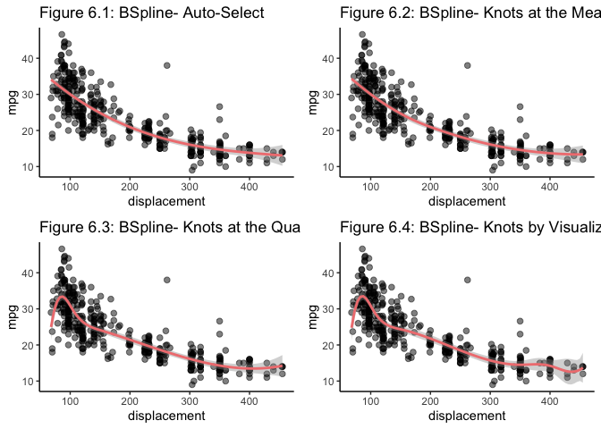
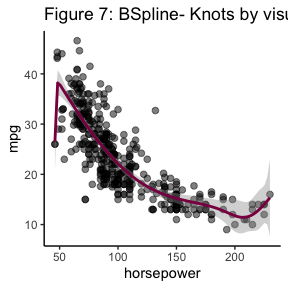
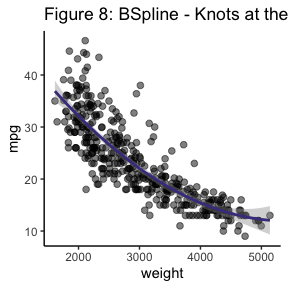
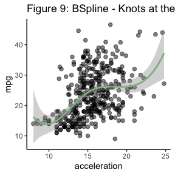

Fuel Efficiency Analysis
================
Srishti Bhargava
3/10/2019

## Abstract

The dataset under consideration is the Auto MPG data from the UCI
Machine Learning Repository by Dua, D. and Graff, C. (2019) and has the
following variables – name, mpg, displacement, acceleration, cylinders,
weight, horsepower, origin and year model. This report uses statistical
methods to analyze this dataset and answer the following question – Can
car attributes such as displacement, horsepower, weight and acceleration
to determine fuel efficiency in miles per gallon? Furthermore, it aims
to find which of these attributes is the best predictor of fuel
consumption with the help of statistical modelling methods.

Upon conducting the analysis it was concluded that displacement is the
best predictor of fuel efficiency among the given variables. While
generalisation error calculations and model assumption violations led tp
the conclusion that there is scope for improvement.

## Introduction

The data set used for analysis is a subset of the Auto-Mpg data set
consisting of the following covariates – MPG, acceleration, horsepower,
weight and displacement , A primary look at the data revealed six
missing values in the variable horsepower which were imputed using
predictive mean matching, by fitting a linear model for the variables
with the missing values and randomizing the coefficients to give
different set of predictions and using one of those arbitrarily. This
was done by using the MICE Package by Stef van Buuren, Karin
Groothuis-Oudshoorn (2011) in R. The completed values are summarized in
the table below:

|     | mpg           | displacement  | horsepower    | weight       | acceleration  |
|:----|:--------------|:--------------|:--------------|:-------------|:--------------|
|     | Min. : 9.00   | Min. : 68.0   | Min. : 46.0   | Min. :1613   | Min. : 8.00   |
|     | 1st Qu.:17.50 | 1st Qu.:104.2 | 1st Qu.: 75.0 | 1st Qu.:2224 | 1st Qu.:13.82 |
|     | Median :23.00 | Median :148.5 | Median : 92.5 | Median :2804 | Median :15.50 |
|     | Mean :23.51   | Mean :193.4   | Mean :104.2   | Mean :2970   | Mean :15.57   |
|     | 3rd Qu.:29.00 | 3rd Qu.:262.0 | 3rd Qu.:125.0 | 3rd Qu.:3608 | 3rd Qu.:17.18 |
|     | Max. :46.60   | Max. :455.0   | Max. :230.0   | Max. :5140   | Max. :24.80   |

Table 1: Summary Table for Auto-mpg data

Scatterplots depicting the relationships between each attribute and MPG
are plotted below. A linear relationship can be observed between most
attributes and the response (MPG). Furthermore, evidence of positive
correlation is observed between MPG and acceleration, and negative
correlation between MPG and the other variables can be seen. A slight
right skew is seen the histogram of the MPG values but not a cause for
concern.The linear model fitting approach is thus concluded to be an
appropriate solution to the problem.

<!-- -->

## Model Fitting and Analysis

The models listed below were fitted assuming the following • Linearity
between MPG and the other attributes • No correlation between
observations • The data is normally distributed

Model Selection between different degrees and attributes was done by
fitting models of varying degrees and calculating the Akaike Information
Critera that measures “the goodness of fit” of a model relative to other
models by computing the maximum liklihood. The polynomial with the least
AIC was then selected for each covariate.

### Linear Regression with varying degree

<!-- -->

Polynomial regression fits models to the data by accommodating for terms
of higher degree than the simple linear model. This allows them to
better capture the variance in the data. The models plotted below
clearly fit better than the linear models shown above. Furthermore, the
improvement in the Adjusted R-Squared indicates that the variance
explained by the models has increased. From the summary table we see
that the Polynomial with the least AIC is the one fitted with the
covariate weight. This is also reiterated by the plots as the weight
confidence intervals indicate the least amount of uncertainty.

The polynomial degree 2 weight model was then subjected to model
assumption tests which revealed a violation of the normality and showed
evidence of autocorrelation. The ouput can be seen in the appendix.

<!-- -->

|              | Degree |      AIC | Adjusted.R.Squared |       RSS |
|:-------------|-------:|---------:|-------------------:|----------:|
| Displacement |     10 | 2278.173 |              0.716 |  6716.524 |
| Horsepower   |     17 | 2294.453 |              0.709 |  6755.108 |
| Weight       |      2 | 2273.886 |              0.713 |  6917.123 |
| Acceleration |      4 | 2681.519 |              0.206 | 19070.703 |

Table 2: Polynomial Regression Model Selection

### Bin-Smooth Regression

Another way of modelling these relationships is by using bin smooth
which divides the data into several defined bins or groups and fits a
linear model for each subset. The models selected by fitting models with
different number elements per bin are plotted below .The instability in
the AIC and Adjusted R-Squared plotted in the index make model selection
difficult as seen in the figures plotted in the appendix (Code for
Binsmooth). According to the AIC based selection method, the best bin
smooth model is the one fitted against displacement but the number of
bins in that model is high which leads to the question of overfitting.
Nevertheless, it was deemed appropriate to go with the model with the
least AIC to maintain consistency in the result. Assumption testing
again showed autocorrelation and non-normality of residuals.
(Appendix:Code for bin-smooth selection)

In the figures below, the top left plot is the binsmooth for
displacement. The top right plot is the one for horsepower. Bottom left
plot for weight and bottom right for acceleration.

<!-- -->

|              | Elements.Per.Bin |    AIC | Adjusted.R.Squared |       RSS |
|:-------------|-----------------:|-------:|-------------------:|----------:|
| Displacement |                3 | 2214.6 |              0.808 |  3101.233 |
| Horsepower   |                2 | 2277.6 |              0.786 |  2607.470 |
| Weight       |               48 | 2272.3 |              0.719 |  6684.356 |
| Acceleration |               10 | 2672.8 |              0.284 | 15648.462 |

Table 3: Bin-Smooth Model Selection

### B-spline Regression

To make a smoother curve to model the relationship between the
covariates, B-Spline regression was used. This method uses piecewise
polynomial functions that join smoothly on knots and depend on the
degree of the polynomial, number of knots and the location of these
knots.

<!-- -->

The B-Spline regression for displacement is plotted above. The first
model was plotted by letting the function decide the degree and knot
placement. The model fitted was a smooth curve with degree two, the
model fit was tested and explained 68% of the variance. The second model
was a degree two model with knot placed at the mean resulted in an
increase in the AIC and thus a degree three model with knots at the 25th
and 50th quantile was fit. This decreased the AIC and improved the
variance explained by the model to 71.3%. Yet, uncertainty regarding
higher values of displacement still existed. A final b-spline was fit
adding knots to the points where uncertainty started increasing as seen
by the confidence intervals, this led to a degree five model and a
slight decrease in the AIC. The findings are summarized in the table
below. A similar process was followed for each covariate.

| Degree |      AIC | Adjusted.R.Squared |      RSS |
|-------:|---------:|-------------------:|---------:|
|      2 | 2309.705 |              0.687 | 7530.594 |
|      2 | 2309.111 |              0.688 | 7519.355 |
|      3 | 2276.088 |              0.714 | 6851.431 |
|      3 | 2275.180 |              0.716 | 6767.466 |

Table 4: B-Spline for Displacement Model Selection

In the horsepower b-spline, while the selected b-spline seems to show a
decrease in confidence regarding the highest, other evidence such as the
minimum AIC suggests that is the best fit for the data as seen in the
summary table. The spline fitted is of degree 7 and explains 69% of the
variance in the data. The other model plots and summary can be seen in
the appendix.

For the weight-mpg b-splines the selected model was the one that let the
software decide the position and number of knots with a degree 3 and
explains 71% of the variance in the data as summarized above. The
varying degrees are still poor fits for extreme values, probably due to
the lack of data.

Finally, the b-spline for acceleration clearly have a poor fit yet for
comparison purposes the model with the knots at mean was selected as it
had the minimum AIC and explained 20% of the variance in the data.

The table below summarizes b-spline results and we see while the
displacement and weight b-splines have an almost negligible difference
in the AIC. The Displacement B-spline is chosen as the best predictor to
keep consistency in the selection criteria. The model assumption tests
again pointed toawards violations in normality and autocorrelation.
(Appendix:Code for B-Spline selection)

|              | Degree |      AIC | Adjusted.R.Squared |       RSS |
|:-------------|-------:|---------:|-------------------:|----------:|
| Displacement |      3 | 2275.180 |              0.716 |  6767.466 |
| Horsepower   |      4 | 2303.056 |              0.696 |  7222.063 |
| Weight       |      2 | 2275.886 |              0.713 |  6917.119 |
| Acceleration |      2 | 2689.547 |              0.187 | 19557.344 |

Table 5: B-Spline Model Selection

## Conclusion

The best predictor of fuel efficiency was found to be the displacement
attribute as two of three different types of the “best” models used it
as a predictor. The resulting generalization error from each model was
computed using the expected prediction error. To do this, the model was
fitted data against the original data. Then the result was used to find
the sum of square of the simulated – predicted data. Low computations of
this indicate a good fit. Since the models seem to violate many of the
assumption the model fit measurement scores seen below are not
surprising.The models have a high prediction error rate. Nevertheless,
the model fitted against the displacement variable seem most trustable.

|            |           |
|:-----------|----------:|
| PolyReg    |  6917.123 |
| Bin-Smooth | 62042.066 |
| B-Spline   |  6767.466 |

Table 6: Expected Prediction Error

## Refrences

• Dua, D. and Graff, C. (2019). UCI Machine Learning Repository
\[<http://archive.ics.uci.edu/ml>\]. Irvine, CA: University of
California, School of Information and Computer Science.

• Stef van Buuren, Karin Groothuis-Oudshoorn (2011). mice: Multivariate
Imputation by Chained Equations in R. Journal of Statistical Software,
45(3), 1-67. URL <https://www.jstatsoft.org/v45/i03/>.

• values, T. (2019). Tutorial on 5 Powerful R Packages used for imputing
missing values. Retrieved from
<https://www.analyticsvidhya.com/blog/2016/03/tutorial-powerful-packages-imputing-missing-values/>

• Allison, P. (2019). Imputation by Predictive Mean Matching: Promise &
Peril \| Statistical Horizons. Retrieved from
<https://statisticalhorizons.com/predictive-mean-matching>

• Hadley Wickham (2017). tidyverse: Easily Install and Load the
‘Tidyverse’. R package version 1.2.1.
<https://CRAN.R-project.org/package=tidyverse>

• John Fox and Sanford Weisberg (2011). An {R} Companion to Applied
Regression, Second Edition. Thousand Oaks CA: Sage. URL:
<http://socserv.socsci.mcmaster.ca/jfox/Books/Companion>

• Joseph L. Gastwirth, Yulia R. Gel, W. L. Wallace Hui, Vyacheslav
Lyubchich, Weiwen Miao and Kimihiro Noguchi (2017). lawstat: Tools for
Biostatistics, Public Policy, and Law. R package version 3.2.
<https://CRAN.R-project.org/package=lawstat>

• R Core Team (2018). R: A language and environment for statistical
computing. R Foundation for Statistical Computing, Vienna, Austria. URL
<https://www.R-project.org/>.

• Baptiste Auguie (2017). gridExtra: Miscellaneous Functions for “Grid”
Graphics. R package version 2.3.
<https://CRAN.R-project.org/package=gridExtra>
